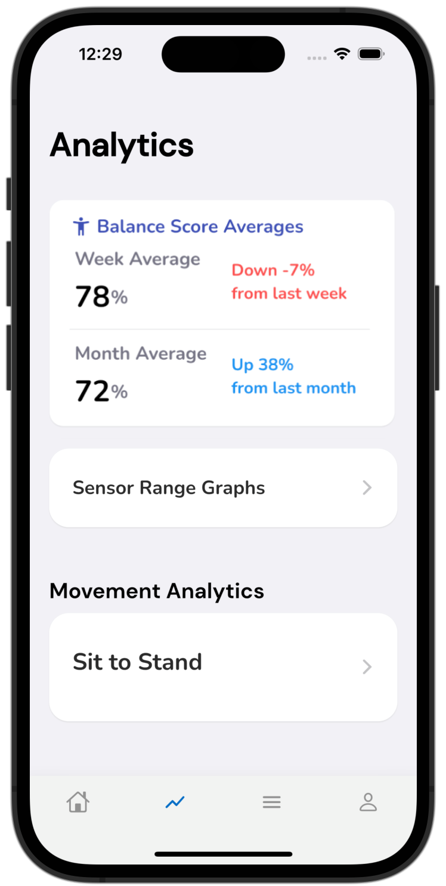
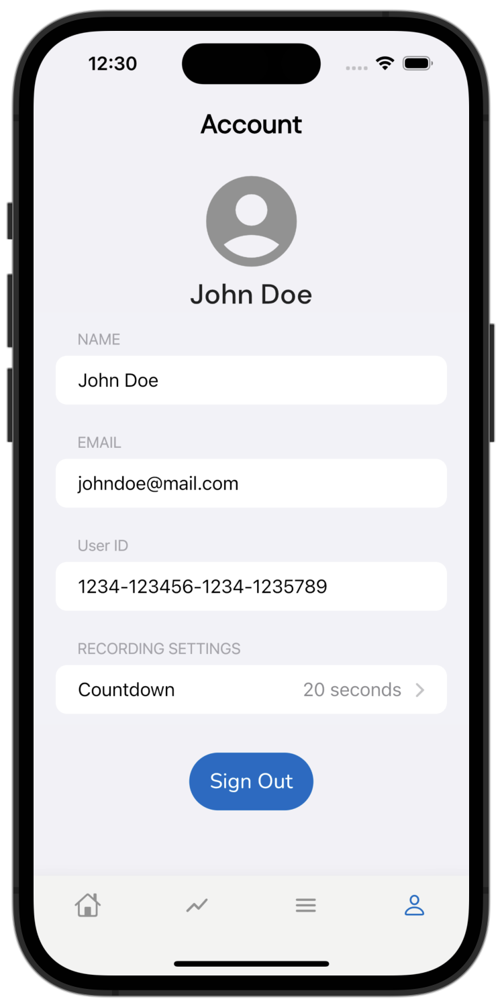
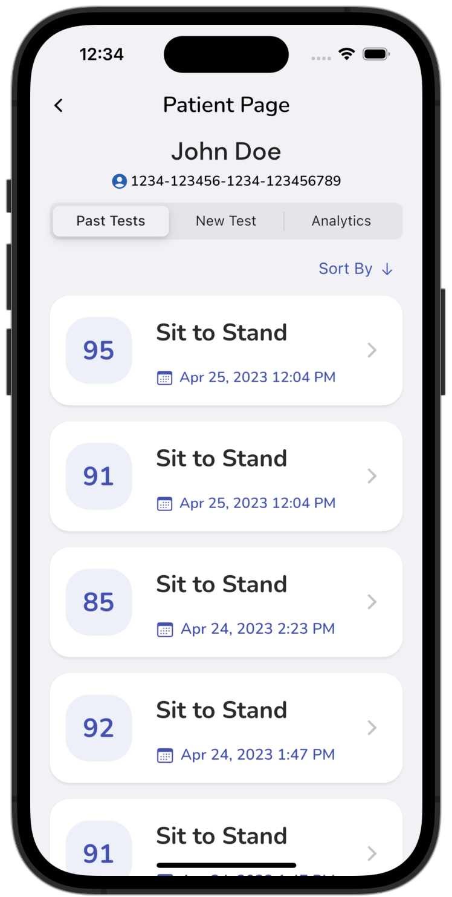
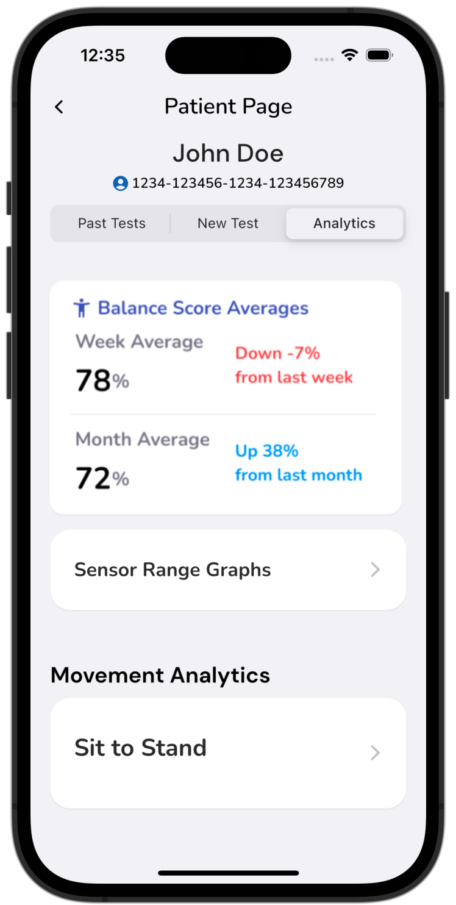

# Balance Test Mobile App
Start by following the instructions [here](https://github.com/UBC-CIC/balance-test-dashboard/blob/main/docs/DeploymentGuide.md) to deploy the backend and web dashboard of the Balance Test project. The Balance Test Mobile App allows you to record IMU sensor data during Balance Test movements and view statistics and analytics of previously recorded tests. 

|Index| Description|
|:----------------|:-----------|
| [Screenshots](#screenshots)         |     View screenshots of the application.    |
| [Deployment](#deployment-guide)         |    Learn how to deploy this project yourself. |
| [User Guide](#user-guide)         |    Learn how to use this application. |
| [License](#license)      |     License details.     |

# Screenshots

## Patient App

  
  
   

  
  
   

## Clinic App

  
  
   

# Deployment Guide

To deploy this solution, please follow our [Deployment Guide](docs/DeploymentGuide.md).

# User Guide

For instructions on how to use the mobile app, refer to the [User Guide](docs/UserGuide.md).

# License

This project is distributed under the [MIT License](./LICENSE).
