# Balance Test Mobile App User Guide

## Patient App

### Home Page

|   |   |
|---|---|
|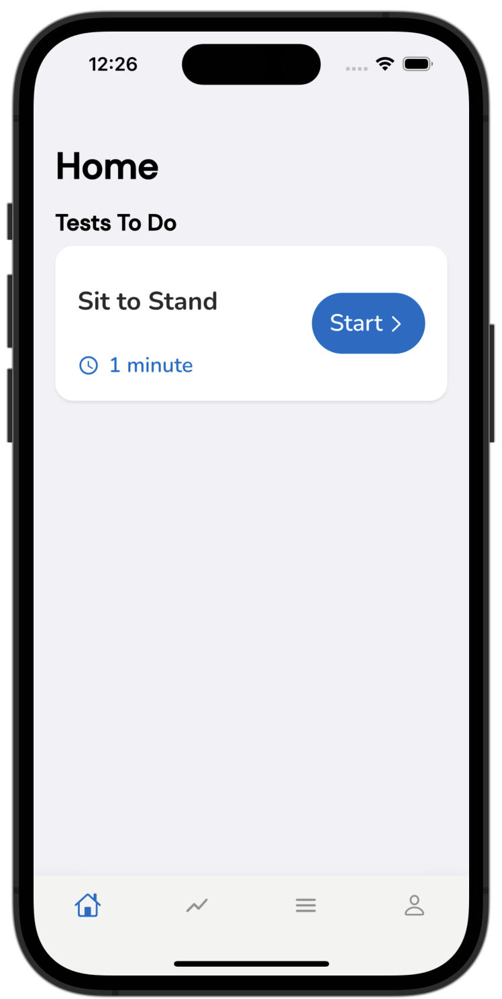| In the Homepage, patients will be able to see the movement tests assigned to them. The estimated movement duration is noted in the bottom left corner. |
|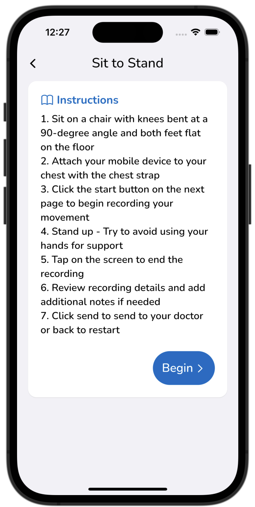| To start the test, click on the `Start` button of a movement test. This will open a new page containing the instructions to the movement. |
|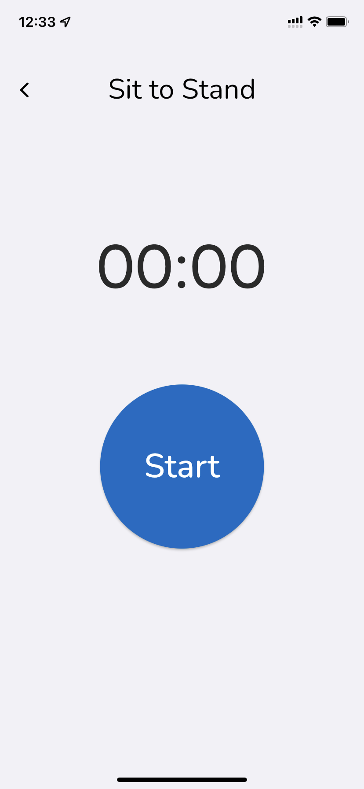| To head to the recording page, click on the Begin button. This will take you to a page with a timer and a `Start` button. |
|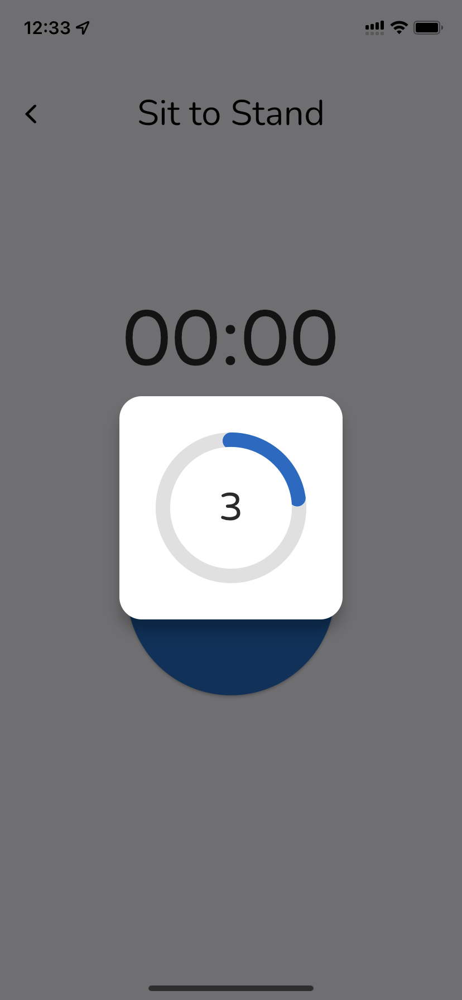| When the `Start` button is pressed, a countdown page will appear to allow you to prepare for the movement. The countdown can be dismissed early by tapping anywhere on the screen. |
|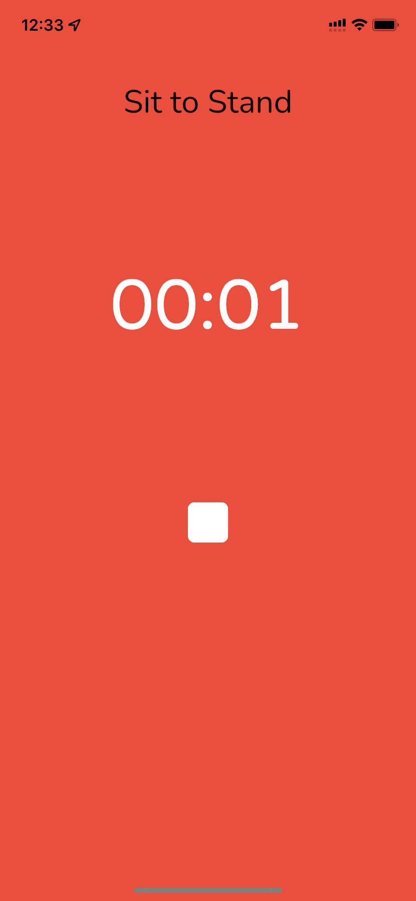| Once the countdown is finished, the app will start recording. To stop the recording, tap anywhere on the screen. |
|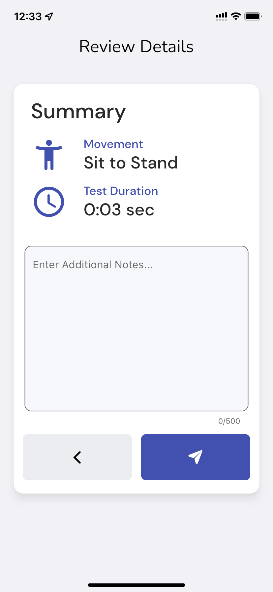| After the test recording, the app will navigate to a summary page for review. Additional notes can be entered and saved if needed. To upload and save the recording to the backend, click on the button with the arrow icon. |

>

### Past Tests Page

|   |   |
|---|---|
|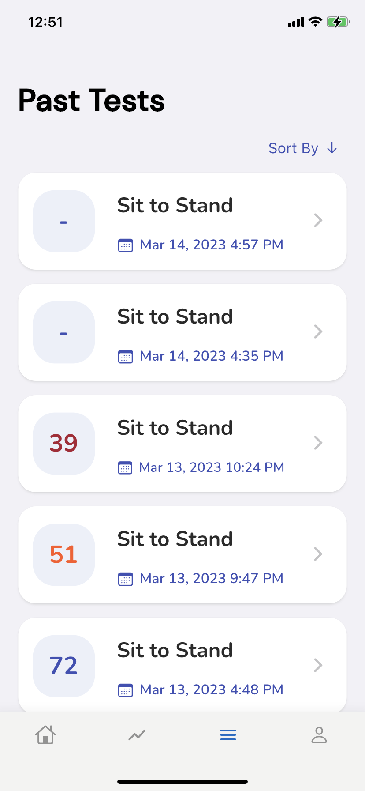| The Past Tests page displays a list of previously recorded movement tests. Each test block displays the score, the movement type, and the date it was completed. |
|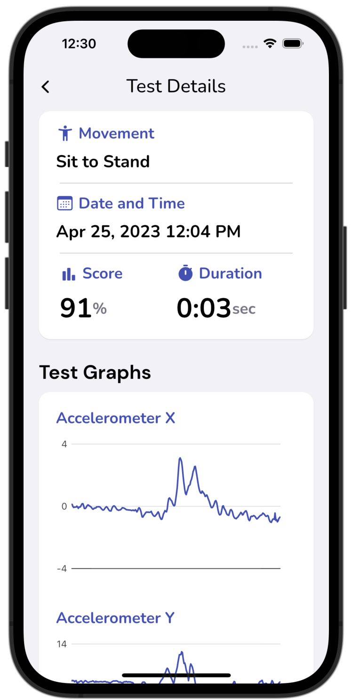| Clicking on a test will open the Test Details page. The test details are displayed here, including date and time, test duration, score, and notes. | 
|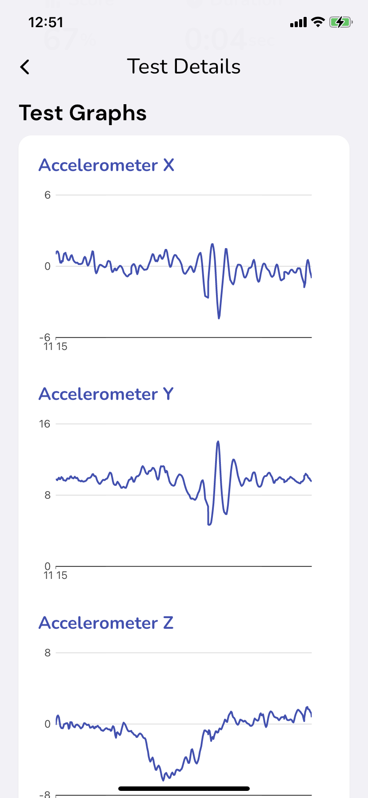| IMU sensor graphs can be found below the test details. These graphs display the raw data recorded from each IMU sensor and axes.|

### Analytics Page

|   |   |
|---|---|
|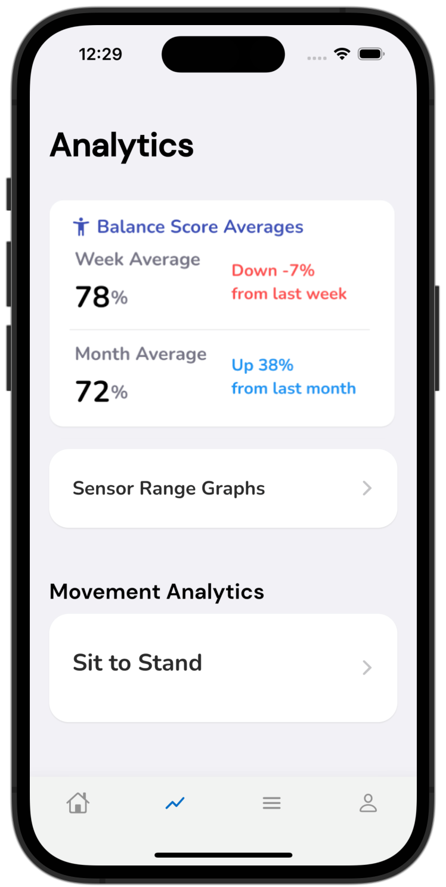|The Analytics page displays the patient’s weekly and monthly balance score averages. Beside the averages shows how the current average compares to the previous week or month. Click on the Sit to Stand analytics button to view more movement specific analytics. |
| | In the Sit to Stand analytics page, the score graph at the top of the page displays the scores of all the tests the patient has completed. Below the score graphs are IMU sensor range graphs. These graphs display the lowest and highest sensor reading of each IMU sensor on each day a Sit to Stand test was recorded. |

### Account Page 

|   |   |
|---|---|
|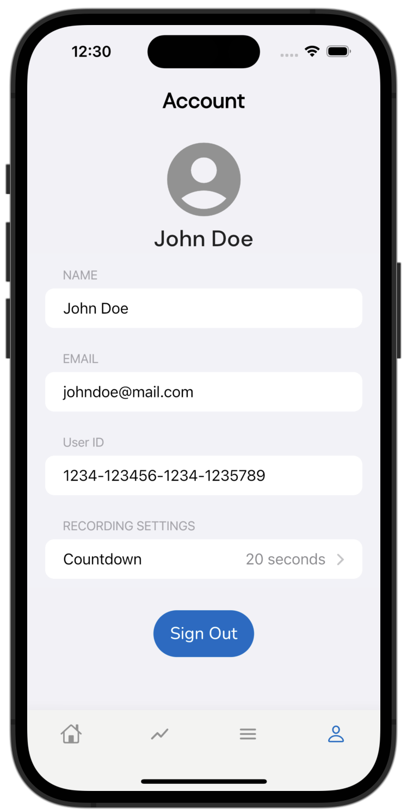| This page allows you to view your account information, including name, email, user ID, and recording countdown time. |
|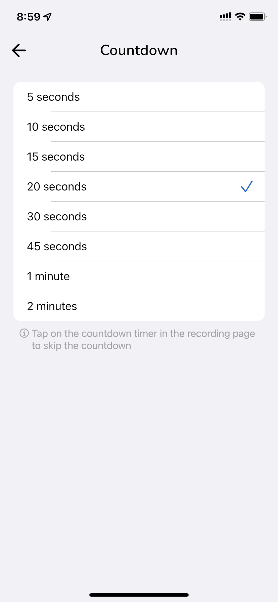| Clicking on the Countdown button will open a page allowing you to change the countdown duration. |

