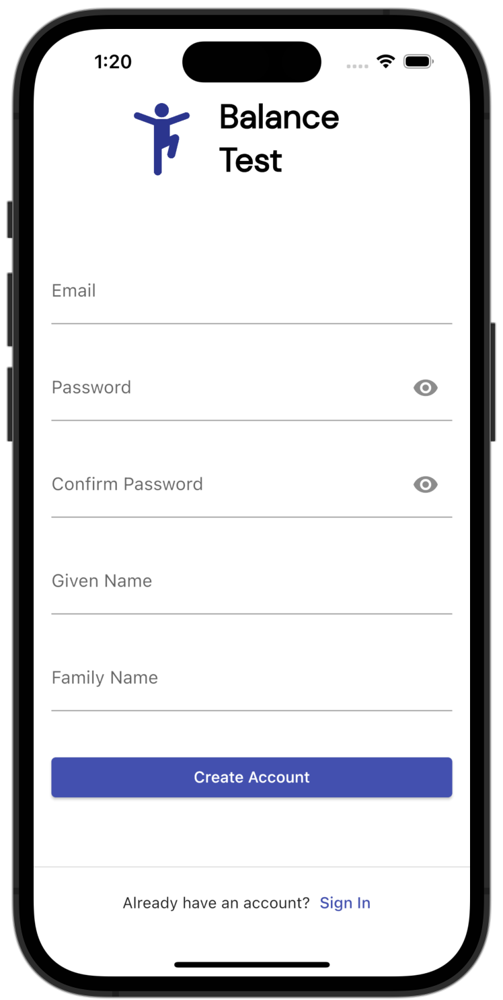
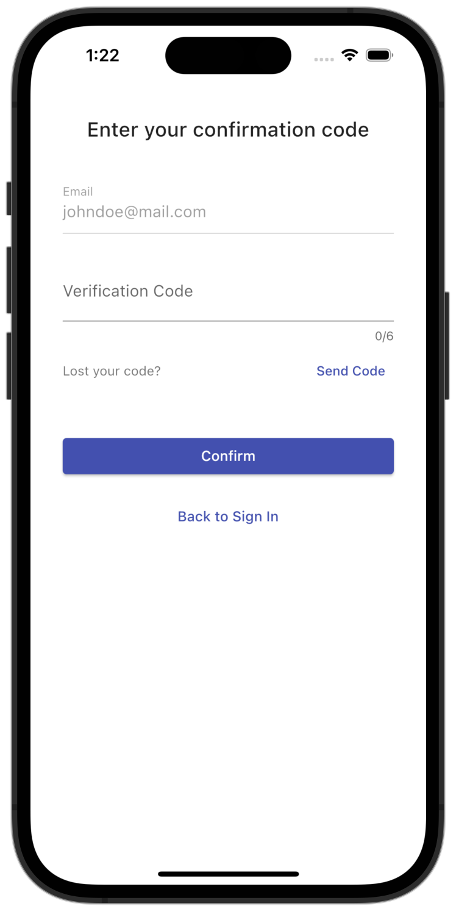
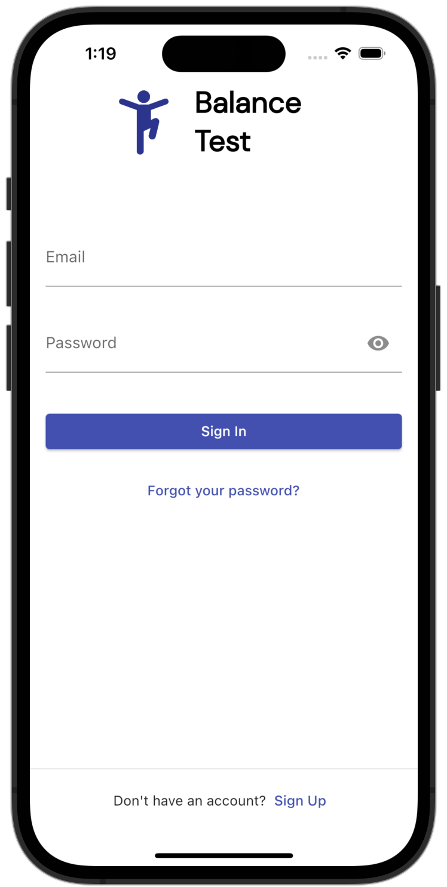
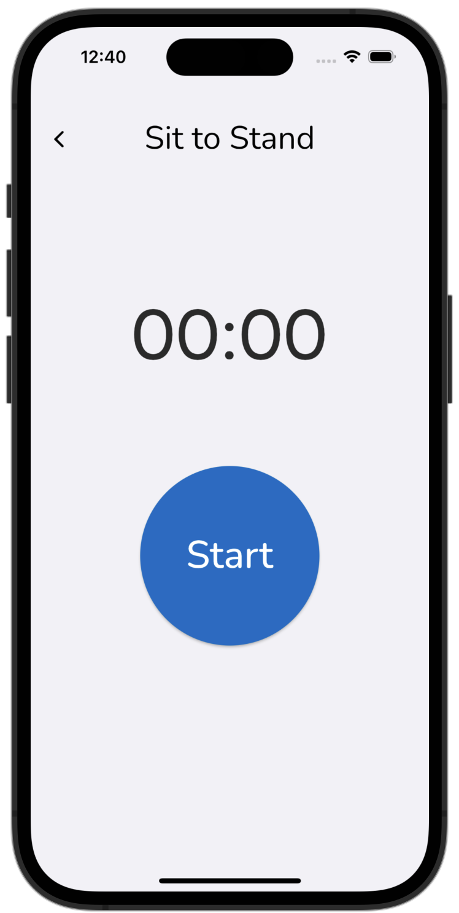
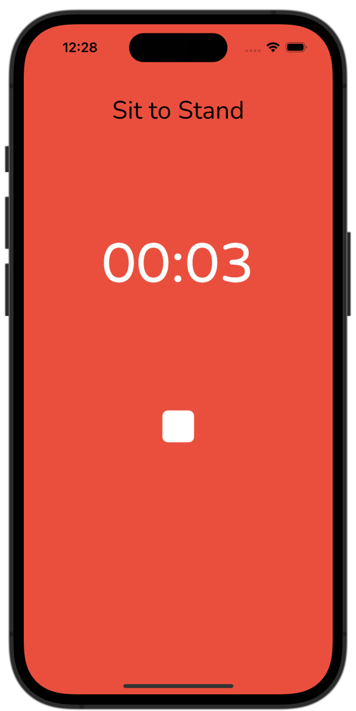
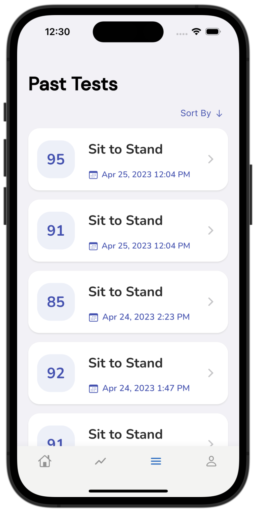
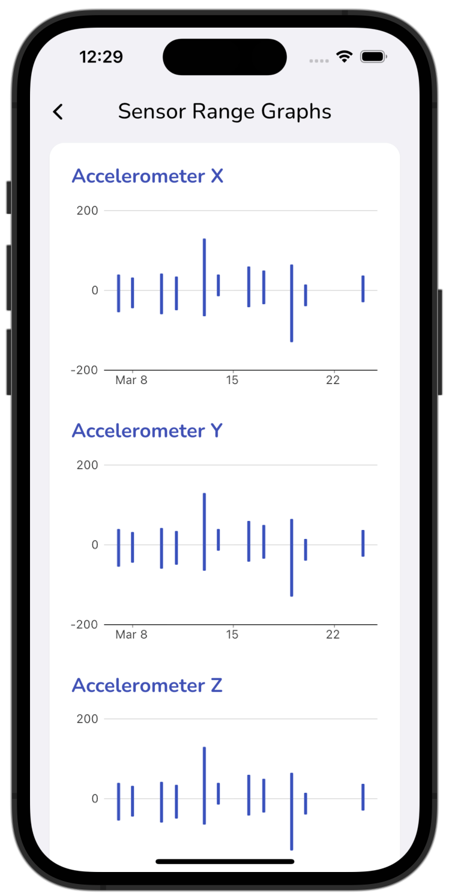
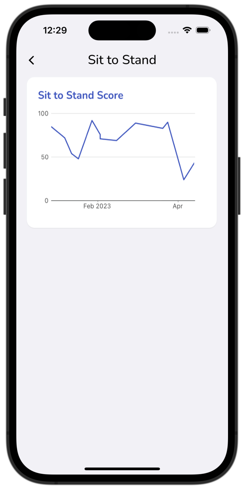
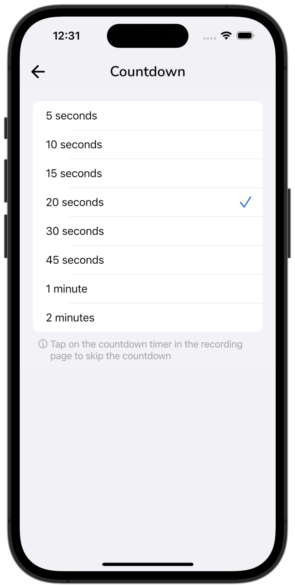
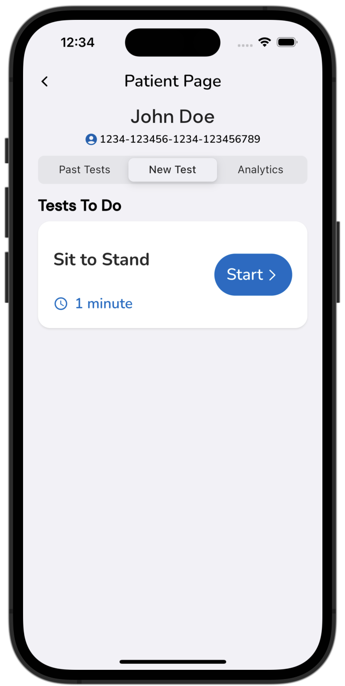

# Balance Test Mobile App User Guide

| Index                                                                    | Description                                 |
| :----------------------------------------------------------------------- | :------------------------------------------ |
| [Creating an Account and Logging In](#creating-an-account-and-logging-in)| How to create an account and login          |
| [Patient App Guide](#patient-app)                                        | How to use the Patient App                  |
| [Clinic App Guide](#clinic-app)                                          | How to use the Clinic App                   |

## Creating an Account and Logging In

### Creating a Patient User Account

|   |   |
|---|---|
|| When the app is first opened patient users are able to create an account by filling in their email, password, and name. |
|| After clicking **Create Account**, a verification code will be sent to the provided email. Patients must enter the code in the app to complete their account creation. |

### Logging In

|   |   |
|---|---|
|| Patients and care providers are able to login from the same login page. Care providers will be directed to the Clinic App and patients will be directed to the Clinic App. Administrator accounts for clinicians can be created in the web dashboard. |

## Patient App

### Home Page

|   |   |
|---|---|
|| In the Home page, patients will be able to see the movement tests assigned to them. The estimated movement duration is noted in the bottom left corner. |
|| To start the test, click on the `Start` button of a movement test. This will open a new page containing the instructions to the movement. |
|| To head to the recording page, click on the Begin button. This will take you to a page with a timer and a `Start` button. |
|| When the `Start` button is pressed, a countdown page will appear to allow you to prepare for the movement. The countdown can be dismissed early by tapping anywhere on the screen. |
|| Once the countdown is finished, the app will start recording. To stop the recording, tap anywhere on the screen. |
|| After the test recording, the app will navigate to a summary page for review. Additional notes can be entered and saved if needed. To upload and save the recording to the backend, click on the button with the arrow icon. |

>

### Past Tests Page

|   |   |
|---|---|
|| The Past Tests page displays a list of previously recorded movement tests. Each test block displays the score, the movement type, and the date it was completed. |
|| Clicking on a test will open the Test Details page. The test details are displayed here, including date and time, test duration, score, and notes. IMU sensor graphs can be found below the test details as well. These graphs display the raw data recorded from each IMU sensor and axes. | 

### Analytics Page

|   |   |
|---|---|
|| The Analytics page displays the patient’s weekly and monthly balance score averages. Beside the averages shows how the current average compares to the previous week or month. |

Click on the Sensor Range Graphs button to navigate to a page to view sensor range graphs.

Click on the Sit to Stand analytics button to view more movement specific analytics. 

|   |   |
|---|---|
|| IMU sensor range graphs are shown in the Sensor Range Graphs Page. These graphs display the lowest and highest sensor reading of each IMU sensor on each day a test was recorded. |
|| In the Sit to Stand analytics page, a score graph displays the scores of all the tests the patient has completed. |

### Account Page 

|   |   |
|---|---|
|| The account page lets you view your account information, including name, email, user ID, and recording countdown time. |
|| Clicking on the Countdown button will open a page allowing you to change the countdown duration. |

## Clinic App

### Patient List Page

|   |   |
|---|---|
|| In the Patient List page of the clinic app, care providers will be able to view the names and user IDs of all patients assigned to them. New patients are able to be assigned in the web dashboard.|

### Patient Page
Clicking on a patient takes you to the Patient Page.

  
  
  

From the Patient Page, the Past Tests page, New Test Page, and Analytics page from the Patient App can be viewed for each patient.

### Assigning Scores and Training a Patient Model

|   |   |
|---|---|
|| In the Test Summary page of recordings done on Clinic accounts, there is an option to assign a score between 0-100 for the tests. For every 10 tests sent with an assigned score, a traning job will be started to train the patient's machine learning model on all tests that have been sent with an assigned score. |

NOTE: Scores can only be assigned from the Clinic App in administrator accounts created from the web dashboard.
